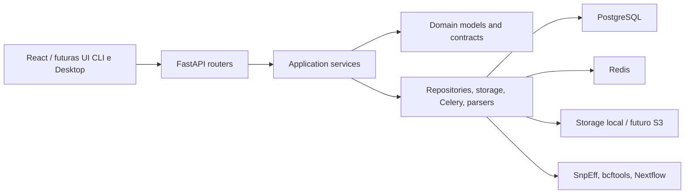
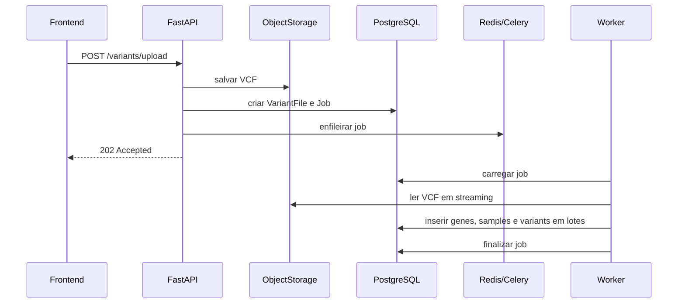

# Arquitetura do GenForge

## Objetivo arquitetural

GenForge nasce como aplicação web, mas o domínio deve ser reutilizável por futuras interfaces CLI e Desktop. Por isso, regras de negócio e fluxos de aplicação ficam fora da camada HTTP sempre que possível.

## Camadas

## Backend modular

Cada módulo do backend tem responsabilidade isolada:

- `core`: configuração, banco, segurança e utilitários compartilhados.
- `auth`: registro, login e JWT.
- `users`: gestão de usuários.
- `projects`: projetos de pesquisa e ownership.
- `samples`: amostras vinculadas a projetos.
- `variants`: upload, ingestão, persistência e consulta de variantes.
- `annotation`: porta para SnpEff/Nextflow.
- `storage`: contrato para armazenamento local ou remoto.
- `tasks`: Celery e jobs assíncronos.
- `reports`: contratos para relatórios.
- `gwas`, `ml`, `genomic_selection`: interfaces futuras.

## Estado atual da Fase 1

O MVP atual mantém o escopo em `auth`, `users`, `projects`, `storage`, `samples` e `variants`.

- `auth` registra usuários, autentica com JWT e protege endpoints privados.
- `projects` possui CRUD completo com validação de ownership por usuário.
- `storage` salva uploads em `storage_data/projects/{project_id}/` e mantém apenas metadados no banco.
- `variants` registra `VariantFile`, `VariantProcessingJob` e variantes consultáveis por paginação.
- O frontend consome `VITE_API_BASE_URL`, autentica usuários, gerencia projetos, envia VCF e exibe arquivos/jobs e variantes paginadas.

Módulos futuros como GWAS, EMS, IA, primers e pipelines NGS continuam fora do escopo de implementação da Fase 1.

## Fluxo de upload e ingestão

No ambiente de desenvolvimento, o upload HTTP cria o arquivo e o job imediatamente. A ingestão completa depende do worker Celery executar `variants.process_variant_file`; por isso, testes manuais no servidor devem validar API, Redis/Celery e banco juntos.

## Endpoints principais da Fase 1

- `GET /` e `GET /health` para smoke checks.
- `POST /api/v1/auth/register`, `POST /api/v1/auth/login` e `GET /api/v1/users/me`.
- `GET /api/v1/projects`, `POST /api/v1/projects`, `GET /api/v1/projects/{project_id}`, `PATCH /api/v1/projects/{project_id}` e `DELETE /api/v1/projects/{project_id}`.
- `POST /api/v1/variants/upload?project_id={uuid}`.
- `GET /api/v1/variants?project_id={uuid}&limit=25&offset=0`.
- `GET /api/v1/variants/files?project_id={uuid}`.
- `GET /api/v1/variants/jobs?project_id={uuid}` e `GET /api/v1/variants/jobs/{job_id}`.

## Banco de dados

Tabelas iniciais:

- `users`
- `projects`
- `samples`
- `genes`
- `variant_files`
- `variant_processing_jobs`
- `variants`

Todas as tabelas iniciais usam UUID como chave primária e devem manter `created_at` e `updated_at`. A migration `202606260001_add_updated_at_to_phase1_tables.py` adiciona `updated_at` às tabelas da Fase 1 que ainda não possuíam esse campo.

Índices iniciais:

- `users.email`
- `projects.owner_id`
- `samples.project_id`
- `genes.gene_id`
- `genes.chromosome`
- `variant_files.project_id`
- `variant_files.status`
- `variants.gene_id`
- `variants.impact`
- `variants.sample_id`
- `variants(project_id, chromosome, position)`
- `variant_processing_jobs.status`

## Gargalos previstos

1. Ingestão de VCF com milhões de linhas.
2. Consultas por intervalo genômico em tabelas muito grandes.
3. Anotação SnpEff concorrente consumindo CPU e I/O.
4. Exportação de resultados grandes para relatórios.
5. Genótipos multi-sample, que podem multiplicar cardinalidade rapidamente.
6. Reprocessamento de arquivos e idempotência.
7. Backup/restauração de dados genômicos pesados.

## Decisões para escala

- Upload HTTP só registra arquivo e job.
- Processamento pesado ocorre em worker.
- Parser inicial usa leitura streaming.
- Inserção de variantes é feita em batches.
- Consultas públicas são paginadas.
- Índice composto por projeto, cromossomo e posição.
- Storage é uma porta, permitindo migração para S3/MinIO.
- SnpEff e Nextflow entram atrás de portas, sem contaminar domínio.

## Melhorias planejadas

- Particionar `variants` por `project_id` ou cromossomo.
- Usar `COPY`/staging table para ingestão de alta escala.
- Criar tabela própria para genótipos e chamadas por amostra.
- Adicionar deduplicação por hash de variante.
- Implementar RBAC por projeto e organização.
- Mover jobs longos para workflows Nextflow rastreáveis.
- Adicionar OpenTelemetry para tracing de pipelines.
- Adicionar MinIO/S3 para storage de VCF e artefatos.
- Criar índices BRIN para posições genômicas em datasets massivos.
- Implementar exports assíncronos.

## Interfaces futuras

Os módulos `gwas`, `ml` e `genomic_selection` possuem apenas contratos. A regra é conectar novas capacidades por serviços de aplicação e portas de infraestrutura, sem acoplar FastAPI diretamente às bibliotecas científicas.
